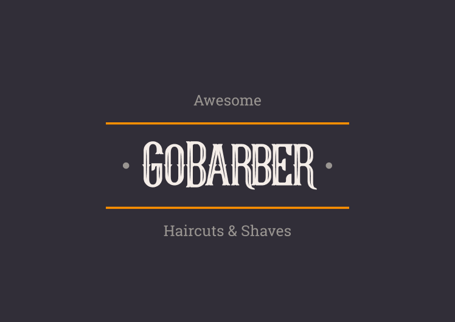

# GoBarber

📜 Projeto desenvolvido durante o BootCamp GoStack da @Rocketseat.

💡 O Gobarber é um app destinado a donos e clientes de barbearias.
É usado para realizar o agendadento de horáio de atendimento, possuindo versão Web e Mobile

## 🚧️ Em Desenvolvimento 🚧️

O projeto ainda está em desenvolvimento e as próximas atualizações serão voltadas nas seguintes tarefas:

### 🛠️ Back End 🛠️ 

- ✅️ Cadastro de Agendamentos (prévia)
- ✅️ Cadastro de Usuarios (prévia)
- ⌛️ Autenticação

### 🛠️ Front End 🛠️ 

- ⌛️ Loading ...

### 🛠️ Mobile 🛠️ 

- ⌛️ Loading ...

## 🔧️  Tecnologias | Ferramentas | Recursos

Até o momento, este projeto contém os seguintes recursos:

## Geral

-  [ESLint](https://eslint.org/)
-  [Prettier](https://prettier.io/)
-  [Visual Studio Code](https://code.visualstudio.com/)

## Backend
-  [Node.js](https://nodejs.org/en/)
-  [TypeScript](https://www.typescriptlang.org/)
-  [Bcrypt](https://www.npmjs.com/package/bcrypt)
-  [date-fns](https://date-fns.org/)
-  [Express](https://expressjs.com/)
-  [TypeORM](https://typeorm.io/#/)
-  [node-postgres](https://www.npmjs.com/package/pg)
-  [PostgreSQL](https://www.postgresql.org/)

## Frontend

- ⌛️ Loading ... 

## Mobile

- ⌛️ Loading ...